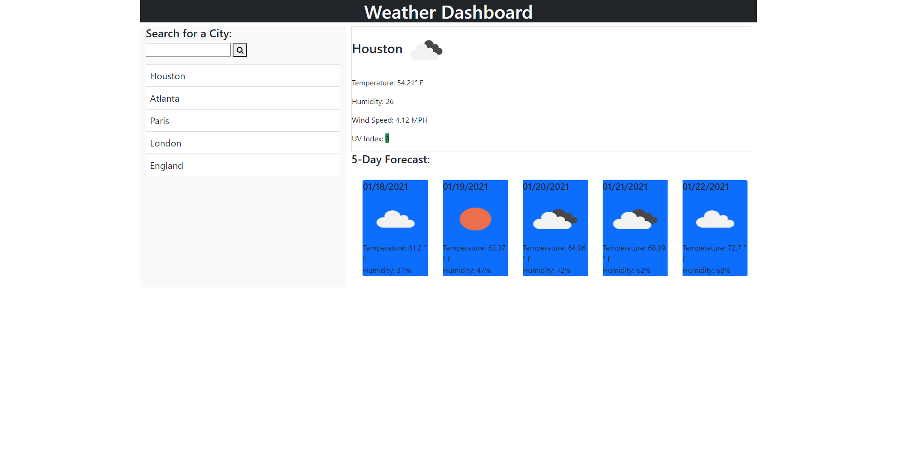

# Weather Dashboard

## Purpose
Create a dashboard that allows the user to enter a city name and then pull weather data. The current data is displayed on the right of the screen with the following information: City name and cloud-cover icon, temperature, humidity wind speed, and UV index (color coded due to deverity). Below that is the 5-day forecast. Each day is a separate card with the following information: date, cloud-cover icon, temperature, humidity. Below the search box the user's search history is displayed and can be clicked on to redisplay the weather data.

## Built With
* HTML
* CSS/Bootstrap/Font Awesome
* Java Script/Jquery/Moment.js

## Contents
1 html file and an Assets folder. The folder contains a css folder with the style.css sheet (unused), an images folder with screenshots of the website, a js folder with the script.js file.

## Website
https://dragoonkite.github.io/weather-dashboard/

## Contribution
Made with ❤️ by DragoonKite

### ©️2020 Frank DePaolo